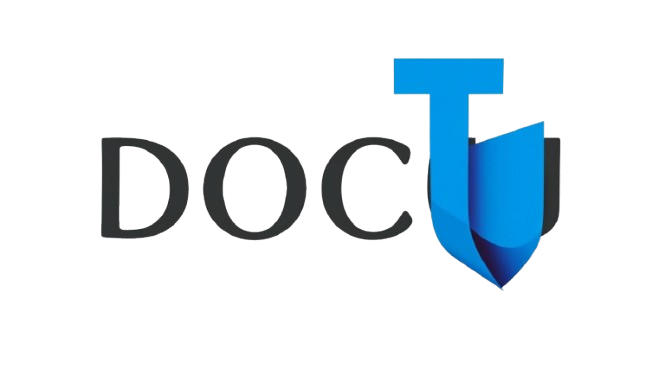

  

 
  <b>
	  <a href="https://github.com/neojelll/DocuTide" target="_blank">DocuTide</a> - The Ultimate Service for Effortless Documentation Creation!
	</b> 

 
  
	
	
	
	

# 🌟 Description

Welcome to **DocuTide**, your go-to service for effortlessly creating stunning documentation! Designed with the everyday user in mind, DocuTide features an intuitive editor that allows anyone—regardless of technical expertise—to craft their own static sites dedicated to any topic.

## Key Features:

- **User-Friendly Editor:** No programming skills required! Our editor simplifies the documentation creation process.

- **Collaborative Work:** Team up with others to create comprehensive documentation seamlessly.

- **AI Assistance:** Leverage AI tools to enhance your documentation and streamline your workflow.

- **Easy Publishing:** Share your static sites on a DocuTide subdomain with just a few clicks!

DocuTide also serves as a vibrant community platform, where users can showcase their public projects and documentation for feedback and collaboration.

# 🚀 Project Focus

- **Empowering Non-Programmers:** We aim to assist users with no programming background in writing and publishing static documentation sites.

- **Fostering Team Collaboration:** Enable collaborative efforts in documentation writing, making it easier to share knowledge.

- **Creating a Supportive Community:** Build a space for users to comment, critique, and assist each other in the documentation process.

# 🏗️ Current Development Status

We are excited to announce that we are currently in the process of developing our **Minimum Viable Product (MVP)!** This foundational version of DocuTide will embody our core features and provide a solid base for future enhancements. Stay tuned for updates as we work towards launching this innovative platform!

# 📊 Architecture

Explore our architecture through the following diagrams:

- [System Context Diagram](architecture/diagrams/system-context-diagram.png)
- [Containers Diagram](architecture/diagrams/containers-diagram.png)
- [MVP Containers Diagram](architecture/diagrams/mvp-diagram.png)

# 📜 License

DocuTide is [MIT licensed](LICENSE).
