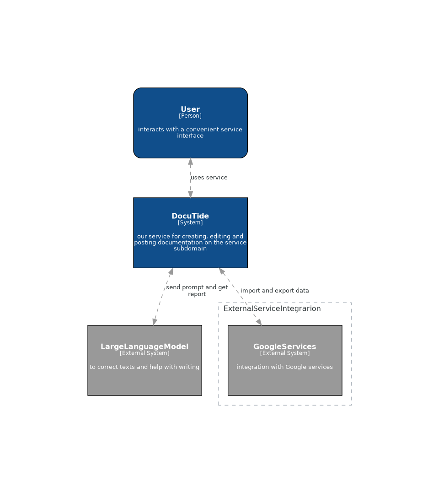
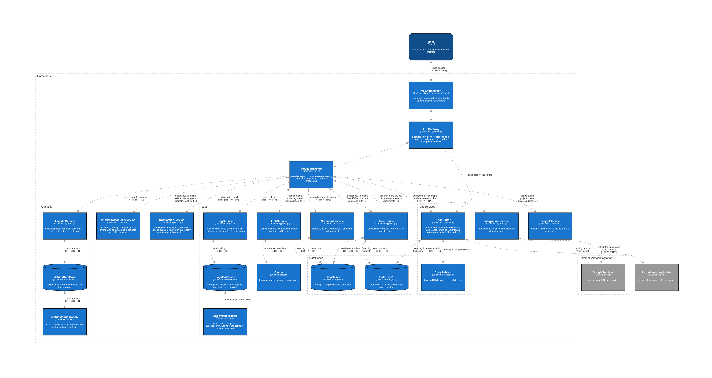

  

	<b><a href="https://github.com/neojelll/DocuTide" target="_blank">DocuTide</a> - service for quickly creating documentation.</b>

	
	
	
	
	

## Description

DocuTide is a service where users can create their own static sites with documentation in a user-friendly and understandable editor for ordinary users. Which supports teamwork and AI assistant assistance. You can also place these static sites on the DocuTide subdomain in a couple of clicks

DocuTide also acts as a kind of social network where, if desired, users can place their public projects with documentation for evaluation and commentary by other users

## Project focus

* Helping users who have nothing to do with programming in writing and publishing static sites with documentation on any topic

* Enable users to work on documentation as a team

* Creating some kind of space where people can comment and help each other in writing documentation

## Architecture

### System context

### Conrainers

## License

DociTide is [MIT licensed](LICENSE)
